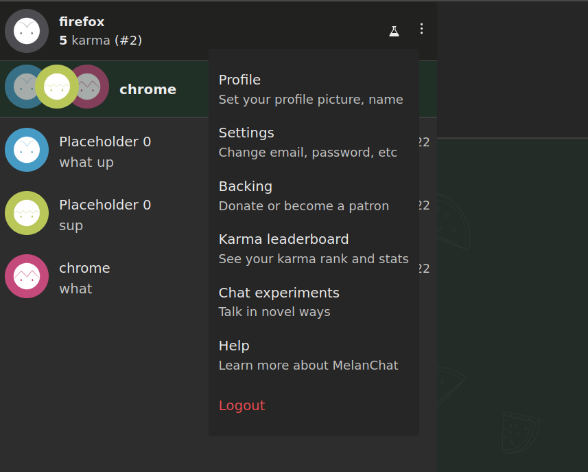
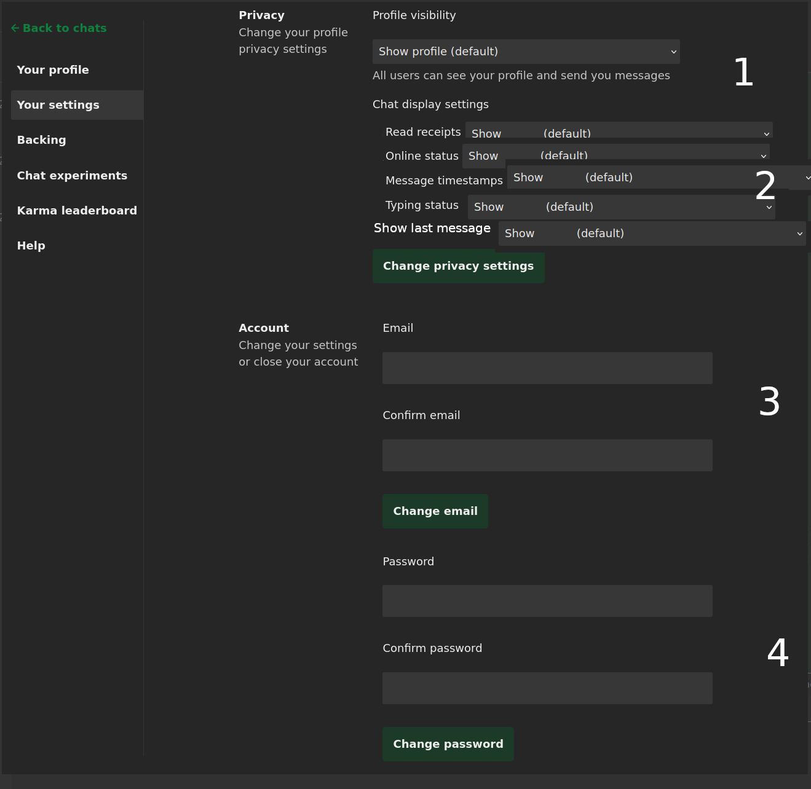
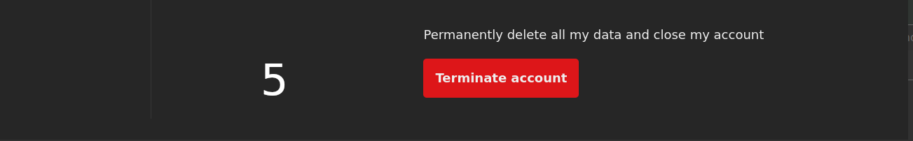
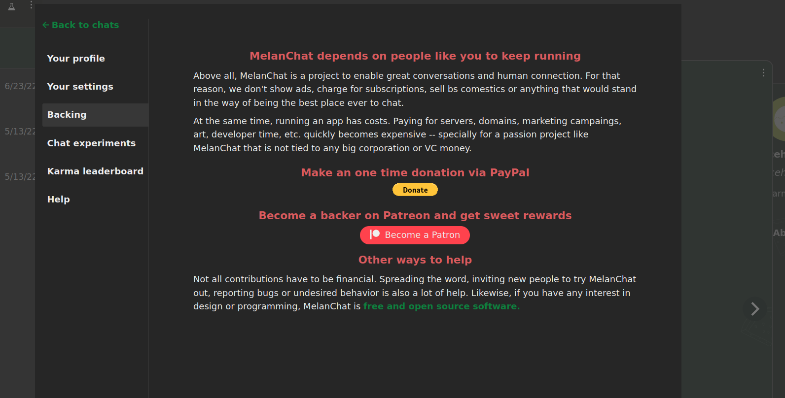

# User

User is an individual account on the application.

# Table of contents

1. [User Information](#user-information)

2. [User Creation](#user-creation)

3. [Login](#login)

4. [Logout](#logout)

5. [Recover Password](#recover-password)

6. [Update Profile](#update-profile)

7. [Update Settings](#update-settings)

## User Information

The following data about an User is visible to other Users on the application:

* Avatar

* Name

* Headline

    * Tagline to draw attention

* Description

    * Bio/about

* Age

    * Calculated from birthday

* Tags

    * A list of free text items indicating interests/hobbies/topics/etc

* Gender

    * M/F/NB/O

* Country

* Karma

    * See [Karma](../gamification/requirements.md#karma)

* Trophies

    * See [Trophies](../gamification/requirements.md#trophies)

* Badges

    * See [Badges](../gamification/requirements.md#badges)

* Languages

    * A list of languages this User can speak

* Online status

    * Online
        * The user is on the app
    * Last seen _time_
        * The last time the user was in the app

Conversely, the following information is private:

* Email

* Password

    * Saved encrypted in the database

* Visibility status

    * Who can chat with this User: Everyone, Every but temporary users, Only contact list, No one

* Privacy status settings

    Visibility of read receipts, online status, message info (including timestamps), typing status: Everyone, Every but temporary users, Only contact list, No one. Visibility is two-way, that is, if an User disables typing status, they can't see others typing status, and so on

    Toggle for contact list entries: Show last message in the chat, Display headline

* Reactions

    * See [Reactions](../gamification/requirements.md#reactions)

* Private notes

    * User can tag other Users to help identifying them or remembering something

## User Creation

Besides the usual account sign up found in most websites, users may be registered as throwaways for purposes of testing the app- such users are called Temporary Users in this document. Temporary Users do not require entering any information to sign up- but expire after logout (be it by manually logging out or end of browser session) or 3 days, and cannot edit their profile. Temporary Users can be made permanent at any time by updating their setting with the necessary [information](#update-settings).

* This page is only available to non logged in Users

* Logged in Users are redirected to /im

1.  Email

    * Must be unique

2.  Password

    * Must be at least 5 characters

3. (Regular) User creation

4. Temporary User creation

On sign up, User is created with auto generated values for Avatar, Name, Headline and Description. Browser is redirected to /im

## Login

Login works as traditional by supplying email and password.

* This page is only available to non logged in Users

* Logged in Users are redirected to /im

* Non logged in Users are redirected to this page when trying to access the following pages: /im, /settings

* User keeps logged in until they log out, i.e., session does not expire

1. Email

    * Must be previously registered

2. Password

3. User logs in and is redirected to im

## Logout

Users can manually end their session at any time.

* A regular logged in User is redirected to the landing page after logging out

* A temporary logged in User is forever deleted from the application after logging out

## Recover Password

Users can request to reset their password in the occasion it is lost. Password reseting is done via email, by supplying a secret link- the application never emails existing passwords.

* This page is only available to non logged in Users

* Logged in Users are redirected to /im

1. Email

    * Must be previously registered

2. A reset link will be sent to the email

    * The reset link expires after 1 day

    * The reset link is invalid if already used

The reset links leads to

* This page is only available to non logged in Users

* Logged in Users are redirected to /im

* Password and password confirmation must match and be at least 5 characters long

* After password reset, User receives an email saying their password was reset

## Update Profile

User can update their public information here.

* For Temporary Users edition is disabled and there is a link to register, whereas regular users click on fields to toggle edition (i.e., fields are changed as edited, no "save" button)

1. Avatar

    * Autogenerated if unset

2. Name

    * Autogenerated if left blank

3. Headline

    * Autogenerated if left blank

4. Age

5. Gender

6. Country

7. Languages

8. This line is not editable

9. List of tags

10. Description

    * Autogenerated if left blank

## Update Settings

User can update their private information here.

* For Temporary Users display a [register form](#user-creation) instead

1. Profile visibility

2. [Privacy settings](#user-information)

3. Update email

4. Update password

5. Delete all data associated with this User, including chats

## Backing

##  Blocked users management

1. Number of users currently blocked

2. Displays list of blocked users

3. Allow to unblock
